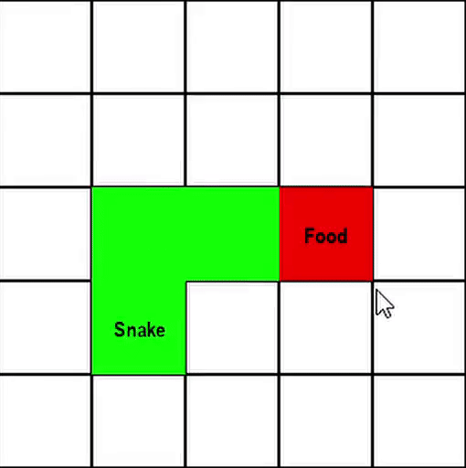

# 🐍 Snake Game using Q-Learning (Reinforcement Learning)

<p align="center">
  
</p>

An autonomous **Snake AI** trained with **tabular Q-Learning** that learns to
survive, grow, and collect food through reinforcement learning.

---

## 🔍 Overview

This project implements the classic Snake game and trains an agent from scratch
using **Q-Learning**. After training, the agent runs in a **continuous,
fully-autonomous play mode**, making decisions based on a learned Q-table.

The goal of this project is to demonstrate a clean and practical implementation
of reinforcement learning concepts using Python.

---

## 🧠 Reinforcement Learning Approach

- **Algorithm**: Tabular Q-Learning  
- **State Representation**:
  - Immediate danger detection (up, down, left, right)
  - Relative food direction from the snake head  
- **Action Space**: Up, Down, Left, Right  
- **Reward Function**:
  - +25 for eating food  
  - +2 for moving closer to food  
  - -2 for moving away from food  
  - -100 for collisions  
- **Exploration Strategy**: Epsilon-greedy with decay  

---

## 🎮 Execution Modes

### ▶ Training Mode
- Agent explores the environment
- Learns optimal actions via the Bellman update rule
- Training optimized for fast convergence

### 🔁 Autonomous Play Mode
- Uses the trained Q-table
- No exploration (pure exploitation)
- Snake runs **continuously** until the window is closed

---

## 🚀 Running the Project

### Clone the repository
```bash
git clone https://github.com/Ishu6129/AgenticAi.git
cd AgenticAi/QLearning
````

### Install dependencies

```bash
pip install -r requirements.txt
```

### Start the game

```bash
python snake_q_learning.py
```

---

## 📦 Dependencies

```
pygame
numpy
```

---

## 🤖 AI Assistance Disclosure

This project was developed with the assistance of AI tools (such as ChatGPT)
for debugging, optimization, and structural guidance.
All code and concepts were reviewed, validated, and fully understood by the author.

---

## 📘 What You’ll Learn

* How tabular Q-Learning works in practice
* Designing reward functions for RL agents
* Engineering compact and efficient state spaces
* Managing exploration vs exploitation
* Building autonomous agents using Pygame

---

## 🛠️ Possible Enhancements

* Deep Q-Network (DQN) implementation
* Larger grid environments
* Saving/loading trained Q-tables
* Performance visualization and metrics

---

## 📜 License

This project is licensed under the **MIT License**.